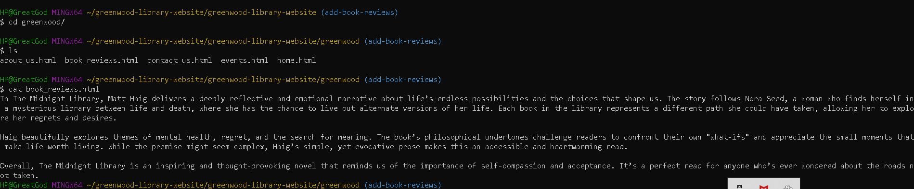
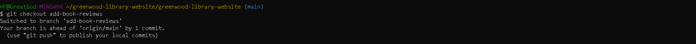

<<<<<<< HEAD
# Greenwood-library-website

## This is a breakdown of how I created my greenwood-library-website repository

## main branch creation

Then I created the following files and added some random contents as regards to the instructions in  the project requirements

I created a folder named greenwood also and created the html files in them immediately

# Below are the random contents provided in the html files created

## About-us content

## Contact-us content

## Events content

## Home html content

# Then i crteated and switched to branch add-book-reviews

 then added a random content 
 

 I added correction to git and commit new changes afterwards i pushed to main origin for pull request 

 

 ## Jamie's Work: Updating Events Page

 

 afterwards i pushed Jamie's work to naib origin

 

afterwards i went on my github to pull request and merge changes to complete my project.
=======
# GREENWOOD-LIBRARY-WEBSITE
>>>>>>> fc331d91019204fec0279a9c52c2dce0e79b8fc8
